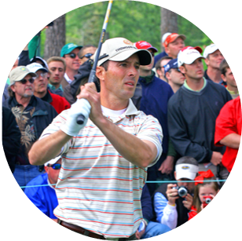

```{r setup, include=FALSE}
options(htmltools.dir.version = FALSE)
knitr::opts_chunk$set(
  fig.width=9, fig.height=3.5, fig.retina=3, fig.showtext = TRUE,
  out.width = "100%",
  cache = FALSE,
  echo = FALSE,
  dev = "svg",
  message = FALSE, 
  warning = FALSE,
  fig.show = TRUE,
  hiline = TRUE,
  text_font_size = "40px"
)

cache_dir <- here::here("inst","analysis","cache/")
cache_files <- list.files(cache_dir)

tx_def <-  function() {theme_xaringan(text_font_size = 10,
                 title_font_size = 10)
}


```

```{r xaringan-themer, include=FALSE, warning=FALSE}
library(xaringanthemer)
library(tidyverse)
library(gghighlight)
style_mono_light(
  base_color = "#002F6C",
  title_slide_text_color = "white",
  link_color = "#ED8B00",
  text_bold_color = "#ED8B00"
)

# class: title-slide, bottom, left
# background-image: url(images/img-baby-in-nicu1.jpg)
# background-size: cover
# 
# .pull-left[
# ## 2021 ~~Masters~~ Amateurs Pool
# 
# Tim Disher, PhD, RN]
```

class: title-slide, bottom, center
background-image: url(images/masters-logo.png)
background-size: cover


### 2021 Masters Pool EVERSANA Performance
#### Room for Improvement

---
# Executive Summary
.pull-left[
```{r, out.width=500}
knitr::include_graphics("https://media.tenor.com/images/178ec783de0a8c61a6c37202cf6ff589/tenor.gif")
```
]

.pull-right[
####EVERSANA Final Leaderboard Position (out of 272) 
Tim  -  **106**  
Jason  -  **121**  
Chris -  **159**  
Imran -  **163**  
Ryan -  **220**  


]

---

# Background

.pull-left[
#### The Tournament
- The Masters is a golf tournament that takes place over four days. The winner gets
a green jacket (pictured right)

#### The Pool
- A fundraiser for [three brothers](https://www.cbc.ca/news/canada/nova-scotia/sydney-project-honours-brother-1.5801362#:~:text=A%20Sydney%20family%20is%20turning,about%20their%20feelings%20and%20emotions.), a Sydney charity to raise awareness for men's mental health.
- Each participant chose 8 golfers from three groups:
  - Group A - 3 golfers (favourites)
  - Group B - 3 golfers (mix)
  - Group C - 2 golfers (mostly bad)  
  
  ]  

.pull-right[
```{r out.width=400, echo = FALSE, fig.cap = "Pictured: This year's winner"}

```
]

---
# Methods

### Golfer Performance
- Simple visual exploration

### Pool Participant Performance

#### Golfer Selection
- Principal Components Analysis followed by k-means clustering to identify
golfers commonly selected together

#### Performance
- Participant profiles generated based on longitudinal performance. 
- Latent class analysis using growth mixture models

---
# Golfer Performance

Maybe watching golf isn't that boring? Leaderboard is dynamic over four days

```{r}


player_pdat <- readRDS(here::here("inst","analysis","cache",cache_files[[grepl("score_pdat", cache_files)]]))


base_p <- player_pdat %>%
  ggplot(aes(x = name, y = value, group = player)) +
  labs(x = "Day of Tournament", y = "Leaderboard Position") +
  scale_y_reverse() + 
  geom_line() + 
  tx_def()
 
base_p + 
  gghighlight(min(value) <= 10) + 
  labs(title = "Leaderboard over time - Ever in Top 10")
  

```

---
# Golfer Choice - No Clear Favourites?
- PCA - ehhh
- Kmeans - kind of useless?

---
# Performance
- Straight to GMM

---
class: split-four


.column[
.center[
]
### Strong Performers
- Performed well on all four days
- Chose players with better pre-masters PGA ranking
- Not an employee of EVERSANA
]  


.column[.center[


### Improvers]
- Start middle of the pack and improve or stay similar
- Chose players with pre-masters ranking between strong and poor performers
- Typical example: 
  - **Jason (162 -> 121)**
  - **Tim (103 -> 106)**
]

.column[.center[


### Decliners]
- Start middle of the pack and decline over time
- Chose players with similar or better PGA rankings than improvers
- Typical example:
  - **Chris (101 -> 159)**
  - **Ryan (166 -> 220)**
  - **Imran (146 -> 163)**
]  


.column[

.center[]
### Poor Performers
- Performed well on all four days
- Chose players with better pre-masters PGA ranking
- Typical example
  - Chris
]